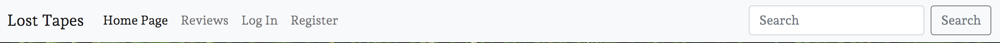

# The Lost Tapes

The Lost Tapes is a website dedicated to music album reviews. The Lost Tapes gives user to read album reviews, write their own album reviews, edit and delete their reviews. Users can also interact with each other in the comment section allowing a community driven ethos which permiates throughout the site. The lost tapes is virtual world where music lovers can share their takes on the latest, or classic, albums and discuss their views and opiniosn on released albums. 

## UX 

The purpose of this website is to deliver a blog-style music site which allows users to create, read, update, and delete reviews. The target auidence for this site is people who are interested in music and would like to read and share the opinions of others on album releases. 

### Project Goals 

The main goal of this website was to deliver CRUD functionality to a blog-style review site. Users can create, read update and delete their own reviews. As well as creating their own reviews they can comment on other's psots and 'like' the posts. 

### User Goals 

### User
As a site user I can register account so that I can interact with site content.

As a site user I can view a paginated list of posts so that I can easily select a post to view.

As a site user I can view a list of reviews so that I can select one to read.

As a site user I can click on a review so that I can read a full review.

As a site user I can create, read update and delete posts so that I can manage my blog content.

As a site user I can like or unlike a post so that I can interact with the content.

As a site user I can create drafts so that I can finish writing site content later.

As a user I can comment on a post so that I can be involved in the post discussion.

As a user I can add comments to a post so that I can be involved in discussion.

As a user I can search the website for a post so that I can quickly find whether the site has the post I am looking for.

### Admin 
As a site admin I can approve or disapprove user uploaded content so that I can manage site content.

## User Expectations 
As there is a specific target audience, music enthusiasts, for this website the following user expectations were considered when creating the site:

* The site is simple, clear and easy to use.
* The structure is logical and obvious.
* The site is responsive and users can expect to see the same content on different devices without a reduction in quality.
* The media content is relevant to the albums listed
* There ability for users to easily navagate the website and search for a specific review. 
* Users can cleary read and interact with the website and the reviews. 

## User Stories 

* Upload pics

## Strategy 

In order to create a site which is relevant to its target auidence, various other related website were researched first in order to comprehensively analyse the features which would be necessary. 

| Feature        | Importance   | Viability |
| ------------- |:-------------:| -----:|
| Display a list of album reivews     | 5 | 5  |
| open a specific album review      | 5      |   5 |
| User sign up | 5      |    5 |
| User CRUD functionality | 5      |    5 |
| User can draft posts | 4      |    5 |
| paginate list of reviews | 5      |    5 |
| Responsive design | 5      |    5 |
| User comments | 4      |    4 |
| User likes / unlikes | 3      |    4 |
| Admin approval of comments | 4      |    5 |
| Users can search for content | 3      |    4 |
| Users have a page of their own content | 2      |    3 |

## Structure 

** Come back to 

### Database Model

* add images 

### Final database 

## Design 

### Wireframes 

• add wireframe images

### Colour Schemes

During the inital design phase, I researched a variety of music review based websites. A common theme across the websites is their commitment to netrual and simplified colour schemes. I adapted this approach when designing my site. The reasoning for this choice is that when users upload album artwork, it can  be in a variety of different colours and styles which could potentially clash with an over exhuberant colour scheme design choice. Keeping a sleek, schematic colour scheme minimises any potential clashes with user uploaded image content and keeps the site asthetically pleasing for the user. White, black and sublte grey on the footer and header were used to keep the colour schemes formularized. 

### Fonts

Andada Pro was chosen at the primary font choice throughout the website. After experimenting with a variety of fonts, Andada Pro provided sleek serif typography which complimented the overall professional, yet calm asthetic of the website. San-serif was chosen as a backup font, should Andada Pro fail. 

# Features 

### Nav Bar 

