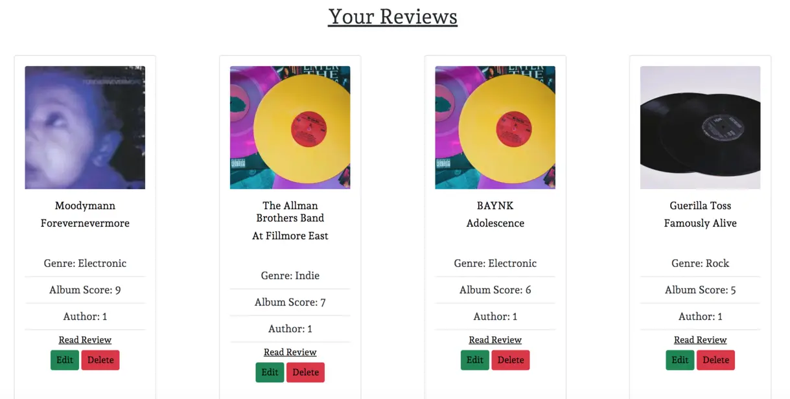

# The Lost Tapes

The Lost Tapes is a website dedicated to music album reviews. The Lost Tapes gives user to read album reviews, write their own album reviews, edit and delete their reviews. Users can also interact with each other in the comment section allowing a community driven ethos which permiates throughout the site. The lost tapes is virtual world where music lovers can share their takes on the latest, or classic, albums and discuss their views and opiniosn on released albums. 

## UX 

The purpose of this website is to deliver a blog-style music site which allows users to create, read, update, and delete reviews. The target auidence for this site is people who are interested in music and would like to read and share the opinions of others on album releases. 

### Project Goals 

The main goal of this website was to deliver CRUD functionality to a blog-style review site. Users can create, read update and delete their own reviews. As well as creating their own reviews they can comment on other's psots and 'like' the posts. 

### User Goals 

### User
As a site user I can register account so that I can interact with site content.

As a site user I can view a paginated list of posts so that I can easily select a post to view.

As a site user I can view a list of reviews so that I can select one to read.

As a site user I can click on a review so that I can read a full review.

As a site user I can create, read update and delete posts so that I can manage my blog content.

As a site user I can like or unlike a post so that I can interact with the content.

As a site user I can create drafts so that I can finish writing site content later.

As a user I can comment on a post so that I can be involved in the post discussion.

As a user I can add comments to a post so that I can be involved in discussion.

As a user I can search the website for a post so that I can quickly find whether the site has the post I am looking for.

### Admin 
As a site admin I can approve or disapprove user uploaded content so that I can manage site content.

## User Expectations 
As there is a specific target audience, music enthusiasts, for this website the following user expectations were considered when creating the site:

* The site is simple, clear and easy to use.
* The structure is logical and obvious.
* The site is responsive and users can expect to see the same content on different devices without a reduction in quality.
* The media content is relevant to the albums listed
* There ability for users to easily navagate the website and search for a specific review. 
* Users can cleary read and interact with the website and the reviews. 

## User Stories 

* Upload pics

## Strategy 

In order to create a site which is relevant to its target auidence, various other related website were researched first in order to comprehensively analyse the features which would be necessary. 

| Feature        | Importance   | Viability |
| ------------- |:-------------:| -----:|
| Display a list of album reivews     | 5 | 5  |
| open a specific album review      | 5      |   5 |
| User sign up | 5      |    5 |
| User CRUD functionality | 5      |    5 |
| User can draft posts | 4      |    5 |
| paginate list of reviews | 5      |    5 |
| Responsive design | 5      |    5 |
| User comments | 4      |    4 |
| User likes / unlikes | 3      |    4 |
| Admin approval of comments | 4      |    5 |
| Users can search for content | 3      |    4 |
| Users have a page of their own content | 2      |    3 |

## Structure 

** Come back to 

### Database Model

* add images 

### Final database 

## Design 

### Wireframes 

Before building the site, Balsamiq was utilised to create wireframes of the site. Wireframes were created in order to develop the websites asthetic and to give an impression of the responsive style across different platforms. 

#### Desktop Homepage 

#### Desktop All Reviews Page

#### Desktop Album Reviews Page

#### Desktop Add Review Page

#### Desktop Edit review Page

#### Desktop Delete Review 

#### Desktop Sign In  

#### Desktop Sign Up

#### Desktop Sign Out

#### Mobile Home Page

#### Mobile All Review Page

#### Mobile Review Detail Page

#### Mobile Add Review 

#### Mobile Edit Review

#### Mobile Delete Review

#### Mobile Sign In 

#### Mobile Sign Up

#### Mobile Sign Out

### Colour Schemes

During the inital design phase, I researched a variety of music review based websites. A common theme across the websites is their commitment to netrual and simplified colour schemes. I adapted this approach when designing my site. The reasoning for this choice is that when users upload album artwork, it can  be in a variety of different colours and styles which could potentially clash with an over exhuberant colour scheme design choice. Keeping a sleek, schematic colour scheme minimises any potential clashes with user uploaded image content and keeps the site asthetically pleasing for the user. White, black and sublte grey on the footer and header were used to keep the colour schemes formularized. 

### Fonts

Andada Pro was chosen at the primary font choice throughout the website. After experimenting with a variety of fonts, Andada Pro provided sleek serif typography which complimented the overall professional, yet calm asthetic of the website. San-serif was chosen as a backup font, should Andada Pro fail. 

# Features 

### Nav Bar 

Every page of the site contain a navigation bar with links to different pages of the site. Each of the links highlight when hovered over to indicate what the user is about to click on. The page which the user is on is highlighed on the navigation bar. The navagation links differ depending if the user is logged in and authenticated or not logged in. 

When logged out the nav bar displays a 'log in' and 'register' link. 

When the user is logged in the nav bar displays the links 'write a post' 'your posts' and 'log out'

Users can use the seach bar to search the site for a specific album review. 

### Footer

The footer features on each page. Footer icon links enlarge when hovered over and links open in a seperate page as to note pull the user away from the site.

### Homepage 

The home page features a hero image with a short overview of what the sebsite is about. 

The home page features the latest 4 reviews uploads. 

### Account pages

When a user clicks on the log in page they are asked to sign in with their username and password

When a user selects the register they are presented with a registrated form with an option email form detail. 

Whilst signed in, users can logg out by clicking on the sign out link which will ask users to confirm signing out 

### Add Review Page

When user is logged in they can add their own review. They are presented with a form where they can input: Album title, artist, genre, an album image, their score out of 10 and their review. Users also have the option to publish straight away or to draft the post and return to it later. The slug for the post is automatically generated so the user does not have the option to decide their own slug. 

For the review body, crispy forms was added so users can have some autonomy on the presentation of their review. Some aspects of cirspy forms were removed from the user however, such as the ability to add images into the body in order to keep the form congruent. 

### Your posts 

Once signed in, users have the ability to navagate to a page which holds all of their reviews on. From here users, can see all of their posts; published or unpublished.

Users can manage their posts here by edit and delete buttons.
 

### Edit & Delete Posts

Users can edit their posts either published or unpublished. 

If a user clicks on 'delete posts' they will be asked again to ensure they want to delete the posts where a larger delete button will appear. Once they click delete again the post will be deleted. 

### Search Posts

Users can ultilise the search bar to search the site for reviews. If the searched word appears in the album title or the artist name, the post will be displayed. 
